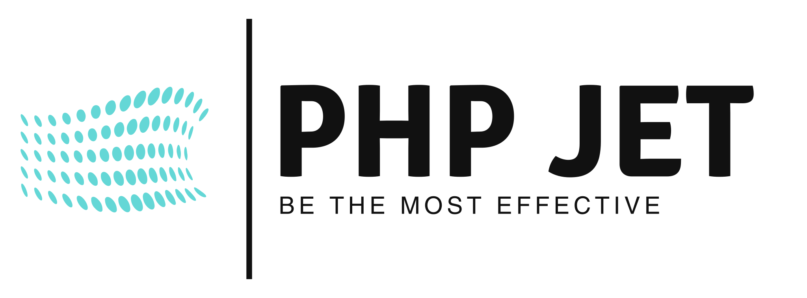
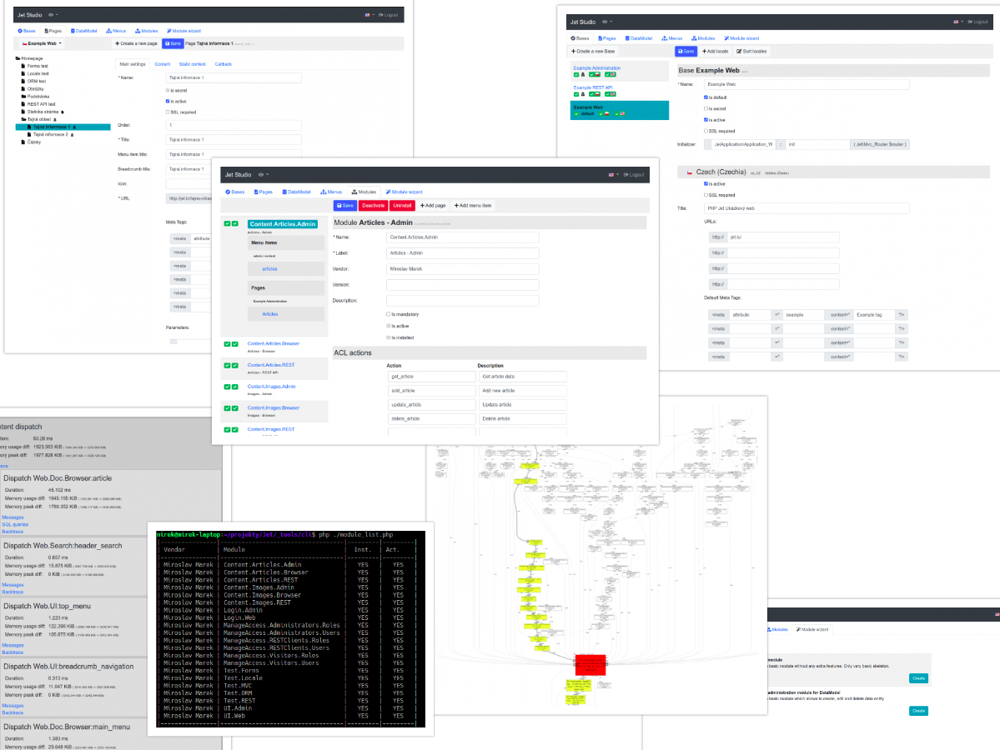

# 🧰 Everything you need

Completely [unique MVC](https://www.php-jet.net/doc/mvc-in-general/jet-mvc) that will make your work much easier, flexible and powerful [ORM](https://www.php-jet.net/doc/orm-datamodel), perfect forms, all ready for international environment, support for [authentication and authorization](https://www.php-jet.net/doc/auth-authentication-and-authorization) including roles and rights, REST, AJAX, server-side UI generation and [many more](https://www.php-jet.net/doc/) ...

Last but not least, the whole system is modular and built on the principle of [micro-applications - application modules](https://www.php-jet.net/doc/application-modules). This will quite fundamentally improve your productivity, testing and deployment, work organization, code reusability and so on.

# 🪛 Integrated tools

Of course, there is not only an integrated profiler, but also a comprehensive sample application, a pre-made admin panel, a pre-made installer and above all the unique and powerful Jet Studio tool that will make your work much easier.

# 🙂 Small and simple

Despite the fact that PHP Jet already includes everything you need in the base, including unique tools, everything remains as simple, small, easy to understand as possible. KISS - Keep It Simple and Straightforward.

The best solution is always the simplest.

#  🛈 Detailed documentation

Detailed and always up-to-date [documentation](https://www.php-jet.net/doc) is available. A large number of video tutorials will be produced in the near future.

# ⚛ Modern

PHP Jet is fully customized for PHP 8. It uses typing, attributes and so on. It is fully future-ready.

# 🚀 Very powerful and safe

PHP Jet is developed by people with experience in banking, telecommunications, e-commerce and so on. So it puts a lot of emphasis on performance and security.

# 👍 Proven by practice

The framework was not developed by theorists, but by people from real practice, by people with decades of experience, by people who are constantly working on specific commercial projects and therefore know the real needs from real practice.

# 🤝 Stable
We know how important stability is. We know what it means to be accountable to our clients and users of our software. PHP Jet is already mature and will not change spontaneously. No unpleasant surprises await you.

# [For a quick introduction to PHP Jet, click here](https://www.php-jet.net/getting-started/)

